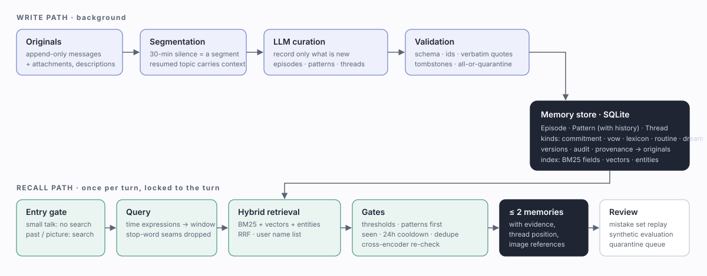

# Penumbra

<p align="center"></p>

<p align="center"><strong>A memory service for long-running AI companions: raw messages are never rewritten, curation keeps only what is new, and recall prefers nothing over noise.</strong><br>
<a href="README.md">中文</a> · <a href="docs/architecture.md">Architecture</a> · <a href="docs/api.md">API</a> · <a href="docs/configuration.md">Configuration</a> · <a href="docs/evaluation.md">Evaluation</a></p>

Penumbra is a standalone local HTTP service. A chat application hands it every message; in the background it curates
the conversation into traceable long-term memory, and on the next turn it returns only the one or two memories that
matter.

## The problem

Companion-style conversations break assumptions most memory layers make:

- **The same thing happens again and again.** Daily greetings and routines should be one memory, not one per day — yet a
  task that advances a little every day (studying, cleaning, writing) needs every step.
- **Things change, and things get misremembered.** "Used to dislike it, likes it now" is a change and keeps its history;
  "I never said that" is a correction, and the wrong state must not survive as history.
- **One story spans weeks.** A job hunt or an exam season is many conversations that belong in time order, not merged
  into one summary.
- **Remembering wrong hurts more than forgetting.** A quoted sentence must really have been said; a memory the user
  deleted must not be curated back into existence.

## Design

| | How |
|---|---|
| Raw messages are the source of truth | append-only originals; every memory points at the messages and attachments it came from |
| Conversation-shaped segments | 30 minutes of silence ends a segment; a resumed topic carries the tail of the previous one |
| Only what is new | the LLM judges against existing memory: progress, a new detail, a first time, a deviation; routines keep one memory that accumulates evidence |
| Three structures | Episode (one event), Pattern (a long-term state and its history), Thread (a multi-conversation story, written up when it ends) |
| Cause and names | causes the source states outright link two episodes, and recalling one brings the other along; every name in the user's list has a neutral profile kept in step with its memories |
| Two clocks | "what did we talk about in May" matches when things were said; "what happened in May" matches when they happened |
| Memory kinds | experience, commitment / vow, shared vocabulary (nicknames, in-jokes), routine, dream (labelled non-factual) |
| Verifiable | quotes checked verbatim against the source; change vs. correction; deletions leave tombstones; every change is versioned and audited |
| Restrained recall | entry gate (small talk does not search) · lexical + vector + entity fusion · time-expression parsing · user-curated names · cooldown and de-duplication · cross-encoder re-check · at most two memories per turn |
| Measurable | a synthetic half-year corpus with structural checks; a user-labelled mistake set that can be replayed at any time |

See [docs/architecture.md](docs/architecture.md).

## Quick start

```bash
git clone https://github.com/kuik82281-arch/penumbra.git
cd penumbra
python -m pip install -e .            # core: numpy only
python -m pip install -e ".[models]"  # optional: local embedding and reranker models (torch + transformers)

export DEEPSEEK_API_KEY=...           # the curation LLM (OpenAI-compatible, see docs/configuration.md)
python -m penumbra serve              # http://127.0.0.1:8790
```

Then `POST /originals` to add messages, `python -m penumbra memory run` to curate, and `POST /memory-core/retrieve` to
recall (examples in the Chinese README and [docs/api.md](docs/api.md)).

## Development

```bash
python -m pip install -e ".[dev]"
python -m pytest -q          # unit tests (no network, no models)
python -m penumbra.eval      # score the generated evaluation state; --rebuild re-curates the corpus with the real LLM
```

## Acknowledgements

Penumbra grew out of ideas shared by many open-source AI memory and companion projects, and by research in the field.
Thanks to their authors for sharing their thinking. Penumbra's architecture is its own design, and its code is an
independent implementation.

## License

[MIT](LICENSE)
